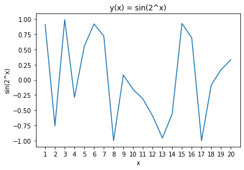
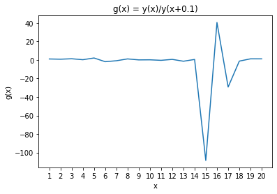
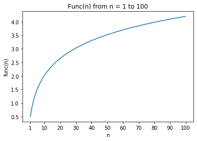
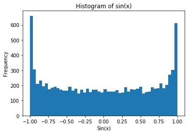
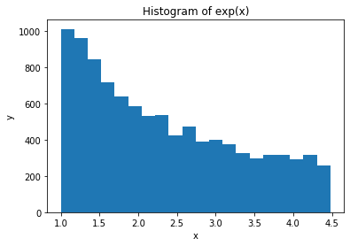
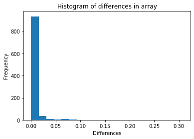
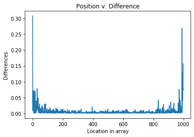

Homework 1 CogSci 131

Problem 1


```python
import numpy as np
import matplotlib.pyplot as plt
```


```python
#x=np.array(range(1,21))
#x=np.array(range(1,21))
x=np.arange(1,21)
y=np.sin([2**i for i in x])
plt.plot(x,y)
plt.xlabel('x')
plt.ylabel('sin(2^x)')
plt.title('y(x) = sin(2^x)')
plt.xticks(range(1,21)) #exact values for the x-axis
plt.show() #sometimes necessary
```





Problem 2


```python
y1=np.sin([2**(i+0.1) for i in x])
g = np.divide(y,y1)
plt.plot(x,g)
plt.xlabel('x')
plt.ylabel('g(x)')
plt.title('g(x) = y(x)/y(x+0.1)')
plt.xticks(range(1,21)) #exact values for the x-axis
plt.show() #sometimes necessary
```





Problem 3a


```python
def func(n):
    sum = 0
    for i in range(1,n+1):
        sum += (1/(i+1))
    return sum
func(5)
```


    1.45


Problem 3b


```python
x = [i for i in range(1,101)]
y = [func(i) for i in x]
plt.plot(x,y)
plt.xlabel('n')
plt.ylabel('func(n)')
plt.title('Func(n) from n = 1 to 100')
plt.xticks([1,10,20,30,40,50,60,70,80,90,100])
plt.show()
```





Problem 4


```python
x=np.random.normal(0,1,10000) 
plt.hist([np.sin(i) for i in x],50) #20 bins (bins are for display purposes, info communication)
plt.xlabel('Sin(x)')
plt.ylabel('Frequency')
plt.title('Histogram of sin(x)')
plt.show()
```





Problem 5


```python
x = np.random.uniform(0,1.5,10000)
plt.hist([np.exp(i) for i in x],20)
plt.xlabel('x')
plt.ylabel('y')
plt.title('Histogram of exp(x)')
plt.show()
```





Problem 6a


```python
arr = np.random.normal(0,1,1000)
arr=np.sort(arr) #sorted samples
diffs = [arr[i+1]-arr[i] for i in range(len(arr)-1)]
plt.hist(diffs,20) #20 bins
plt.xlabel('Differences')
plt.ylabel('Frequency')
plt.title('Histogram of differences in array')
plt.show()
```





Problem 6b


```python
x = [i for i in range(len(arr)-1)]
plt.plot(x,diffs)
plt.xlabel('Location in array')
plt.ylabel('Differences')
plt.title('Position v. Difference')
#plt.xticks([1,10,20,30,40,50,60,70,80,90,100])
plt.show()
```





```python

```
